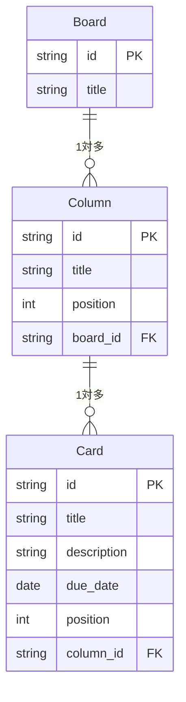

# テーブル定義書・ER図

---

## 1. データ概要

アプリのデータはすべて localStorage に JSON 形式で保存する。

```
localStorage
└── "boards"  ←キー名
    └── Board[]  ←ボードの配列
        └── Board
            ├── id
            ├── title
            └── columns: Column[]
                └── Column
                    ├── id
                    ├── title
                    └── cards: Card[]
                        └── Card
                            ├── id
                            ├── title
                            ├── description
                            └── dueDate
```

---

## 2. テーブル定義

### 2.1 Board（ボード）

| フィールド名 | 型 | 必須 | 説明 |
|------------|-----|------|------|
| id | string | ○ | ボードを一意に識別するID（例：`board-1`） |
| title | string | ○ | ボード名（例：「学習タスク」） |
| columns | Column[] | ○ | このボードに属するカラムの配列（初期値は空配列） |

### 2.2 Column（カラム）

| フィールド名 | 型 | 必須 | 説明 |
|------------|-----|------|------|
| id | string | ○ | カラムを一意に識別するID（例：`column-1`） |
| title | string | ○ | カラム名（例：「ToDo」「進行中」「完了」） |
| cards | Card[] | ○ | このカラムに属するカードの配列（初期値は空配列） |

### 2.3 Card（カード）

| フィールド名 | 型 | 必須 | 説明 |
|------------|-----|------|------|
| id | string | ○ | カードを一意に識別するID（例：`card-1`） |
| title | string | ○ | カードのタイトル（例：「Next.jsの勉強」） |
| description | string | - | カードの説明・メモ。未入力の場合は空文字 `""` |
| dueDate | string | - | 期限日。`YYYY-MM-DD` 形式（例：`"2026-06-30"`）。未設定の場合は `null` |

---

## 3. 保存データの例

```json
[
  {
    "id": "board-1",
    "title": "学習タスク",
    "columns": [
      {
        "id": "column-1",
        "title": "ToDo",
        "cards": [
          {
            "id": "card-1",
            "title": "Next.jsの勉強",
            "description": "App Routerの基礎から始める",
            "dueDate": "2026-06-30"
          }
        ]
      },
      {
        "id": "column-2",
        "title": "進行中",
        "cards": []
      },
      {
        "id": "column-3",
        "title": "完了",
        "cards": []
      }
    ]
  }
]
```

---

## 4. ER図

将来的なDB移行を見据えた論理データモデルを示す。現状はlocalStorageにJSONで保存しているが、RDBに移行する場合は以下の構造を基に設計する。



| フィールド | 補足 |
|-----------|------|
| position | カラム・カードの表示順を保持する数値。D&Dによる並び替えを永続化するために必要 |
| board_id | ColumnがどのBoardに属するかを示す外部キー |
| column_id | CardがどのColumnに属するかを示す外部キー |
