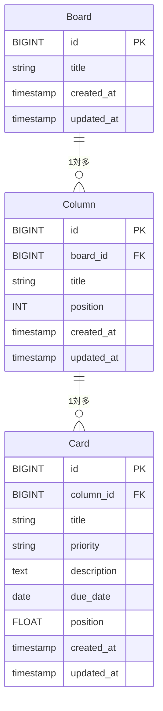

# テーブル定義書・ER図

---

## 1. データ概要

アプリのデータは PostgreSQL データベースに永続化される。Spring Boot バックエンドが REST API を介してフロントエンドとデータをやり取りする。

---

## 2. テーブル定義

### 2.1 Board（ボード）

| カラム名 | 型 | 制約 | 説明 |
|---------|-----|------|------|
| id | BIGINT | PK, AUTO_INCREMENT | ボードを一意に識別するID |
| title | VARCHAR(255) | NOT NULL | ボード名（例：「学習タスク」） |
| created_at | TIMESTAMP | NOT NULL | 作成日時 |
| updated_at | TIMESTAMP | NOT NULL | 更新日時 |

### 2.2 Column（カラム）

| カラム名 | 型 | 制約 | 説明 |
|---------|-----|------|------|
| id | BIGINT | PK, AUTO_INCREMENT | カラムを一意に識別するID |
| board_id | BIGINT | NOT NULL, FK | 所属するボードのID |
| title | VARCHAR(255) | NOT NULL | カラム名（例：「ToDo」「進行中」「完了」） |
| position | INT | NOT NULL | 表示順序（昇順） |
| created_at | TIMESTAMP | NOT NULL | 作成日時 |
| updated_at | TIMESTAMP | NOT NULL | 更新日時 |

### 2.3 Card（カード）

| カラム名 | 型 | 制約 | 説明 |
|---------|-----|------|------|
| id | BIGINT | PK, AUTO_INCREMENT | カードを一意に識別するID |
| column_id | BIGINT | NOT NULL, FK | 所属するカラムのID |
| title | VARCHAR(100) | NOT NULL | カードのタイトル |
| priority | VARCHAR(10) | NOT NULL | 優先度。`"high"` / `"medium"` / `"low"` のいずれか。デフォルトは `"medium"` |
| description | TEXT | NULL | カードの説明・メモ |
| due_date | DATE | NULL | 期限日。`YYYY-MM-DD` 形式 |
| position | FLOAT | NOT NULL | 表示順序（Float型で中間値計算をサポート） |
| created_at | TIMESTAMP | NOT NULL | 作成日時 |
| updated_at | TIMESTAMP | NOT NULL | 更新日時 |

---

## 3. ER図


```mermaid
erDiagram
    Board {
        BIGINT id PK
        string title
        timestamp created_at
        timestamp updated_at
    }
    Column {
        BIGINT id PK
        BIGINT board_id FK
        string title
        INT position
        timestamp created_at
        timestamp updated_at
    }
    Card {
        BIGINT id PK
        BIGINT column_id FK
        string title
        string priority
        text description
        date due_date
        FLOAT position
        timestamp created_at
        timestamp updated_at
    }

    Board ||--o{ Column : "1対多"
    Column ||--o{ Card : "1対多"
```

---

## 4. 並び順（position）の実装

### 4.1 position フィールドについて

- **型**: Float（浮動小数点数）
- **用途**: カード・カラムの表示順序を管理
- **初期値**: カード追加時は、空のカラムなら 1000.0、既存カードがあれば最後のカードの position + 1000.0
- **D&D時の計算**:
  - **最初に移動**: 新しい position = nextCard.position / 2
  - **中間に移動**: 新しい position = (prevCard.position + nextCard.position) / 2
  - **最後に移動**: 新しい position = prevCard.position + 1000.0

この方式により、各操作を 1 度のクエリで実現でき、スケーラブルな設計が実現される。

---

## 5. API レスポンス例

### Board 詳細取得

```json
{
  "id": 1,
  "title": "学習タスク",
  "columns": [
    {
      "id": 1,
      "title": "ToDo",
      "position": 1,
      "cards": [
        {
          "id": 1,
          "columnId": 1,
          "title": "Reactの勉強",
          "priority": "high",
          "description": "基礎から実践まで",
          "dueDate": "2026-06-30",
          "position": 1000.0
        }
      ]
    },
    {
      "id": 2,
      "title": "進行中",
      "position": 2,
      "cards": []
    }
  ]
}
```
